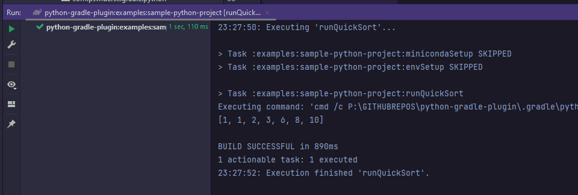

[](https://actions-badge.atrox.dev/PrzemyslawSwiderski/python-gradle-plugin/goto)
[](https://plugins.gradle.org/plugin/com.pswidersk.python-plugin)
[](https://gradle.org/releases/)
[](https://kotlinlang.org/docs/releases.html)

# Python Gradle Plugin

**Now, all what is required to run python scripts is Java.**

This Gradle Plugin uses [Miniconda](https://docs.conda.io/en/latest/miniconda.html)
to run executables (`python`, `pip`, `conda` etc.) from virtual env.

Python project configuration can be fully automated by Gradle tasks.

## Requirements

* Java JDK or JRE version 8 or higher

## Purpose

Running python scripts or projects by executing single tasks which will download and install Python virtual environment.

Additional Python configuration (pip/conda packages installation etc.) can be done by defining Gradle tasks
in `build.gradle.kts` file.

## Usage

### Steps to run python script from Gradle

1. Apply a plugin to a project as described
   on [gradle portal](https://plugins.gradle.org/plugin/com.pswidersk.python-plugin).
2. Configure a plugin by specifying desired python version in build script:
    ```kotlin
    pythonPlugin {
        pythonVersion.set("3.8.2")
    }
    ```
3. Define a task to run desired python script, for example to run `quicksort.py` script in `main` dir add the following
   task configuration to build script:
    ```kotlin
    tasks {
        register<VenvTask>("runQuickSort") {
                workingDir = projectDir.resolve("main")
                args = listOf("quicksort.py")
        }
    }
    ```
4. Run python script from gradle:
    ```shell script
    # Linux
    ./gradlew runQuickSort
    # Windows
    gradlew.bat runQuickSort
    ```

5. Enjoy :)
   

### Python Plugin properties

Plugin default behavior can be adjusted by specifying the following properties:

- `pythonVersion` -> Python environment version, default `3.10.4`
- `minicondaVersion` -> Miniconda3 version, default `latest`
- `minicondaRepoUrl` -> repository URL which should be used to download binaries,
  default `https://repo.anaconda.com/miniconda`
- `minicondaRepoUsername` -> username for the basic auth if needed, empty by default
- `minicondaRepoPassword` -> password for the basic auth, used if `minicondaRepoUsername` is specified, empty by default
- `minicondaRepoHeaders` -> additional optional headers used for connection, empty map by default

- Sample extension config in `build.gradle.kts` file:

```kotlin
pythonPlugin {
    pythonVersion.set("3.8.2")
    minicondaVersion.set("py38_4.8.3")
    minicondaRepoUrl.set("https://nexus.com/repositories/miniconda")
    minicondaRepoUsername.set("user")
    minicondaRepoPassword.set("pass")
    minicondaRepoHeaders.set(
        mapOf(
            "CUSTOM_HEADER_1" to "headerValue1",
            "CUSTOM_HEADER_2" to "headerValue2"
        )
    )
}
```

### Additional examples alongside with sample PipTasks configurations can be found in `examples` module in this project.

## Intellij setup

* To have autocomplete and modules properly recognized in Intellij Idea simply point python executable as described in:
  https://www.jetbrains.com/help/idea/configuring-python-sdk.html
* To have properly recognized imported source modules in tests, right click on sources directory (for example `main`)
  -> `Mark Directory as` -> `as Sources root`.

### Conda install directories (`$` is a configured miniconda version)

#### Linux - `<root-project-dir>/.gradle/python/Linux/Miniconda3-$`

#### Windows - `<root-project-dir>/.gradle/python/Windows/Miniconda3-$`

#### MacOSX - `<root-project-dir>/.gradle/python/MacOSX/Miniconda3-$`

If you are familiar with [conda](https://conda.io/projects/conda/en/latest/user-guide/index.html) you can also execute
conda commands like `conda activate` or `conda install` directly with the binaries from the catalogs above.

## Notes

* It may be required to unset `PYTHONPATH` in system before running any tasks (https://stackoverflow.com/a/31841132)  
