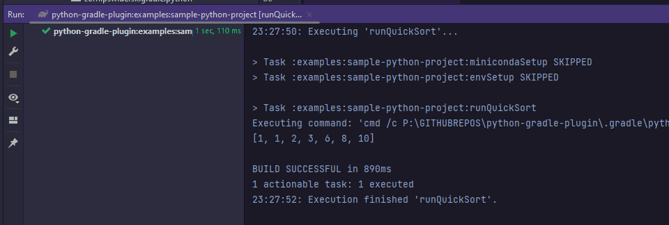
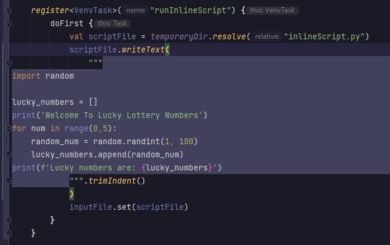

[](https://actions-badge.atrox.dev/PrzemyslawSwiderski/python-gradle-plugin/goto)
[](https://plugins.gradle.org/plugin/com.pswidersk.python-plugin)
[](https://gradle.org/releases/)
[](https://kotlinlang.org/docs/releases.html)

# Python Gradle Plugin

**Now, you can run Python scripts with Java and Gradle builds only.**

This Gradle Plugin **automatically downloads and installs** specific [Conda](https://repo.anaconda.com/) tool
to run python scripts or other executables (`pip`, `conda` etc.) from virtual env.

Python project configuration can be fully automated by Gradle tasks now.

## Requirements

* Java `8` or higher
* Gradle `6.2` or higher project

## Purpose

Running python scripts or projects by executing single tasks which will download and install Python virtual environment.

Additional Python configuration (pip/conda packages installation etc.) can be done by defining Gradle tasks
in `build.gradle.kts` file.

## Usage

### Steps to run python script from Gradle

1. Apply a plugin to a project as described
   on [gradle portal](https://plugins.gradle.org/plugin/com.pswidersk.python-plugin).
2. Configure a plugin by specifying desired python version in build script:
    ```kotlin
    pythonPlugin {
        pythonVersion.set("3.8.2")
    }
    ```
3. Define a task to run desired python script, for example to run `quicksort.py` script in `main` dir add the following
   task configuration to build script:
    ```kotlin
    tasks {
        register<VenvTask>("runQuickSort") {
                workingDir = projectDir.resolve("main")
                args = listOf("quicksort.py")
        }
    }
    ```
4. Run python script from gradle:
    ```shell script
    # Linux
    ./gradlew runQuickSort
    # Windows
    gradlew.bat runQuickSort
    ```
5. Wait until Conda is installed and environment set up.

6. Enjoy :)
   

### Python Plugin properties

Plugin default behavior can be adjusted by specifying the following properties:

- `pythonVersion` -> Python environment version, default `3.10.12`
- `condaVersion` -> Miniconda3 version, default `py311_23.5.2-0`
- `condaInstaller` -> Conda environment installer name, default is `Miniconda3`
- `condaRepoUrl` -> repository URL which should be used to download binaries,
  default `https://repo.anaconda.com/miniconda`
- `condaRepoUsername` -> username for the basic auth if needed, absent by default
- `condaRepoPassword` -> password for the basic auth, used if `condaRepoUsername` is specified, should not be
  passed directly in script file, can be supplied
  by [gradle properties](https://docs.gradle.org/current/userguide/build_environment.html#sec:gradle_configuration_properties)
  , absent by default
- `condaRepoHeaders` -> additional optional headers used for connection, empty map by default
- `installDir` -> property to customize conda installation directory, equals to `<rootProjectDir>/.gradle/python` by
  default
- `systemArch` -> operating system architecture, default is got from `os.arch` system property

Sample extension configuration inside of `build.gradle.kts` file:

```kotlin
pythonPlugin {
    pythonVersion.set("3.7.0")
    condaVersion.set("2022.05")
    condaInstaller.set("Anaconda3")
    condaRepoUrl.set("https://nexus.com/repositories/conda")
    condaRepoUsername.set("user")
    condaRepoPassword.set(extra["conda.repo.pass"].toString())
    condaRepoHeaders.set(
        mapOf(
            "CUSTOM_HEADER_1" to "headerValue1",
            "CUSTOM_HEADER_2" to "headerValue2"
        )
    )
    installDir.set(file(buildDir.resolve("python")))
    systemArch.set("arm64")
}
```

### `VenvTask` task properties

All tasks which should be executed in virtual env can be customized as well by the following fields:

- `venvExec` -> name of executable from virtual env which will be executed, `python` by default
- `inputFile` -> optional input file, none by default
- `outputFile` -> optional output file, none by default
- `args` -> list of arguments for a `venvExec` executable, empty by default
- `workingDir` -> working directory, project directory by default
- `environment` -> map with environment variables to apply during the execution, empty by default

Sample `VenvTask` configuration inside of `build.gradle.kts` file:

```kotlin
register<VenvTask>("runPythonScript") {
    venvExec = "python"
    inputFile.set(file("inputFile.txt"))
    outputFile.set(file("outputFile.txt"))
    args = listOf("--some-flag", "arg1")
    workingDir.set(projectDir.resolve("main"))
    environment = mapOf("ENV_VAR_TO_PRINT" to "sampleEnvVar")
}
```

### Additional examples alongside with sample PipTasks configurations can be found in `examples` module in this project.

## Intellij setup

* To have autocomplete and modules properly recognized in Intellij Idea point to Conda environment as described in:
  https://www.jetbrains.com/help/idea/configuring-python-sdk.html
* To have properly recognized imported source modules in tests, right click on sources directory (for example `main`)
  -> `Mark Directory as` -> `as Sources root`.

### Conda install directories

* Linux - `<rootProjectDir>/.gradle/python/Linux/<condaInstaller>-<condaVersion>`

* Windows - `<rootProjectDir>/.gradle/python/Windows/<condaInstaller>-<condaVersion>`

* MacOSX - `<rootProjectDir>/.gradle/python/MacOSX/<condaInstaller>-<condaVersion>`

Where `<rootProjectDir>` is the root catalog where the project exists, `<condaInstaller>` is Conda installer
e.g. `Miniconda3` and `<condaVersion>` is Conda installer version e.g. `py38_4.8.3`

If you are familiar with [conda](https://conda.io/projects/conda/en/latest/user-guide/index.html) you can also execute
conda commands like `conda activate` or `conda install` directly with the binaries from the catalogs above.

## Notes

* It may be required to unset `PYTHONPATH` in system before running any tasks (https://stackoverflow.com/a/31841132)
* You can also run some simple inline Python scripts inside build files like this:

  

  Intellij 'inject language' feature can be useful in such scenario :)